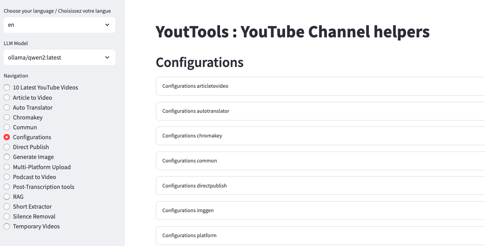
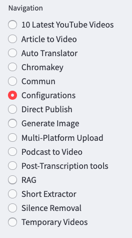

# YouTools
YouTube tools to automate video creation

To start using YouTools you need to :
- Create the config.json, .ll-config.yml and .env files (for each parameter you must modify the values corresponding to you)
- Create a python virtual environment in version 3.10 and install the required python libraries.

## config.json
This is the configuration file reduced to the bare minimum

```json
{
  "common": {
    "channel_id": "",
    "work_directory": "./YOUR_WORKING_DIR",
    "language": "en"
  }
}
```

## .llm-config.yml
```yaml
model_list: 
  - model_name: groq1
    litellm_params:
      model: groq/llama3-70b-8192
      api_base: https://api.groq.com/openai/v1
      api_key: gsk_xxxxxxxxxxxx
  - model_name: ollama-phi3
    litellm_params:
      model: ollama/phi3:medium-128k
      api_base: http://127.0.0.1:11434

general_settings: 
  master_key: sk-xxxxx
```

## .env
GROQ optionnal
HF_TOKEN needed for SoniTranslate
```conf
YOUTUBE_API_KEY=xxxxxxx
GROQ_API_KEY=gsk_xxxxxxxxxxx 
YOUR_HF_TOKEN=hf_xxxxxxxxxxx
```

## Install with pyenv
```bash
pyenv install 3.10
pyenv virtualenv 3.10 .venv
pyenv local .venv
pip install -r requirements.txt
./start.sh
```

## or Install with venv
```bash
python3.10 -m venv env
source env/bin/activate
pip install -r requirements.txt
```

After installation, run the command :

```bash
./start.sh
```

---

## Using YouTools

you can access the url `http://localhost:8502/`



### Update configuration

Go to the Configurations page



and check/modify all the values for each part

don't forget to save :p